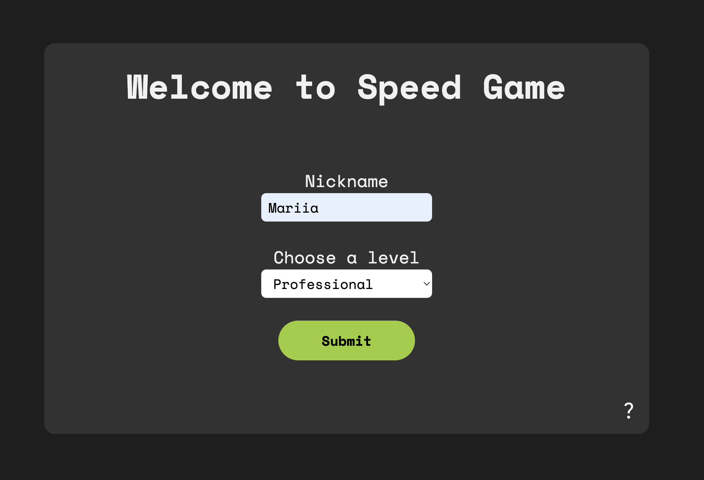
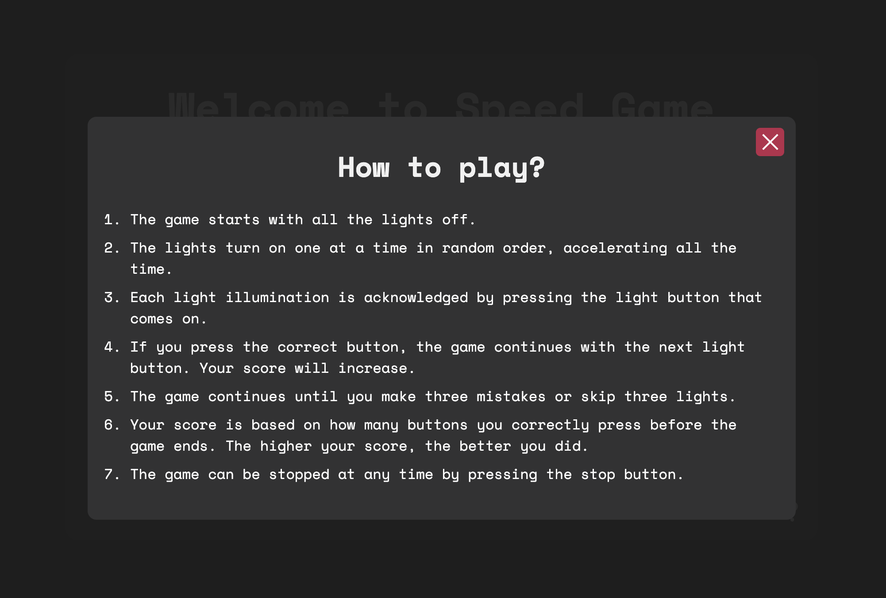
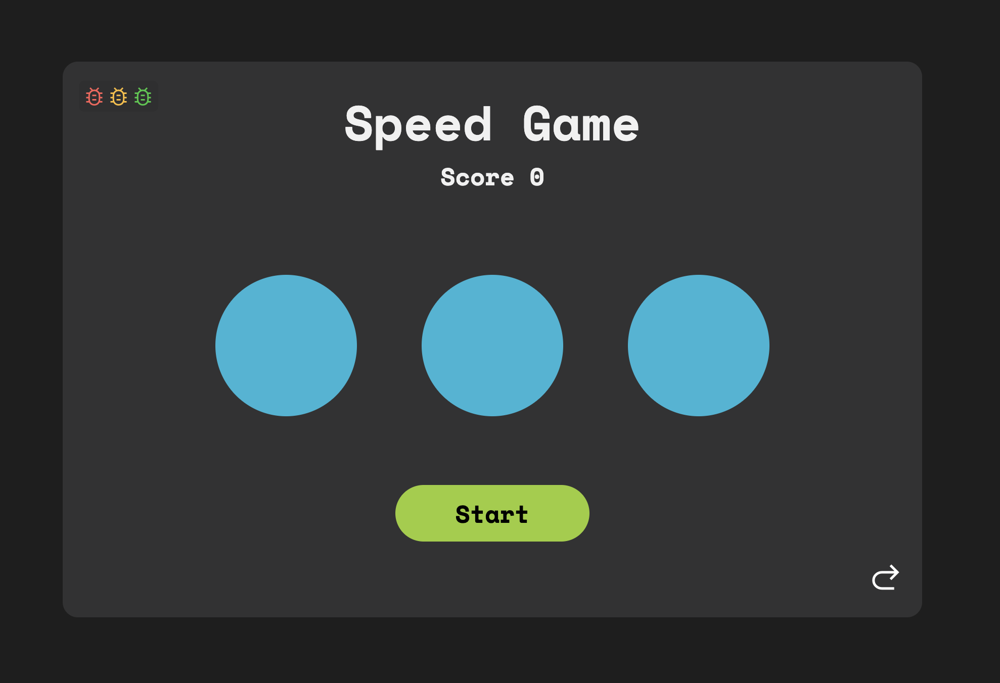
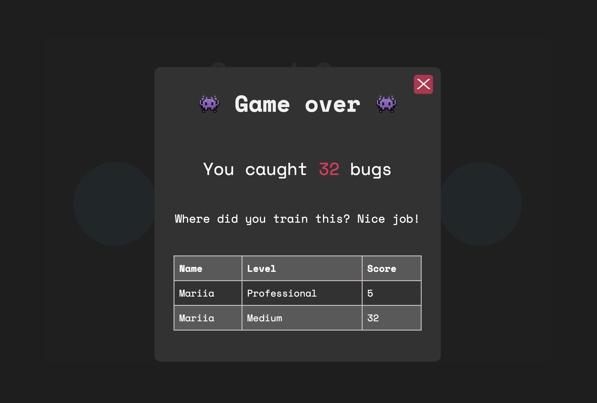

# SPEADGAME

Welcome to the Debuger game! Here you can become a true debugger 🪲🪲🪲

In the new version of the game, you can enter your name and select a difficulty level to track your progress in debugging skills.

Don't forget to read the rules on the welcome page before starting the game!

The game page looks the same, but the number of circles and speed have been changed. Give it a try and see for yourself!

When the game is over, you will see your result, the game board with your progress, and some information about your performance.

---

### **Check it out!**

[Speedgame]()

### Link to my GitHub

[GitHub](https://github.com/MariiaSizova)
